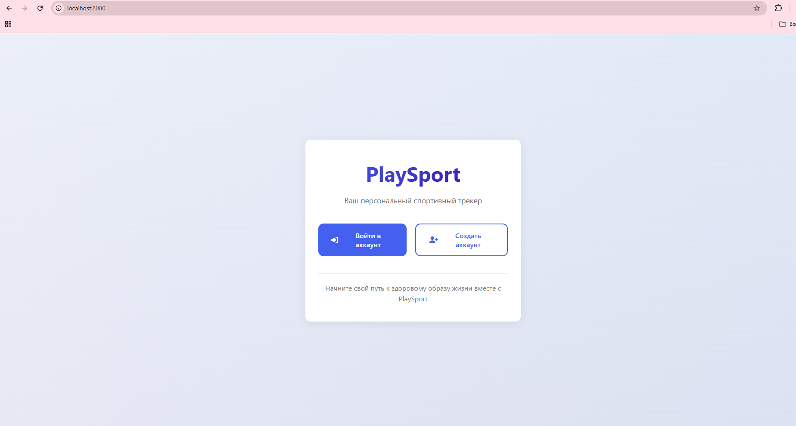
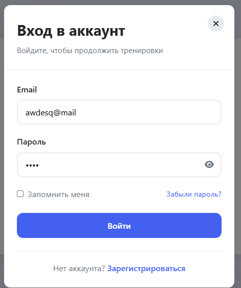
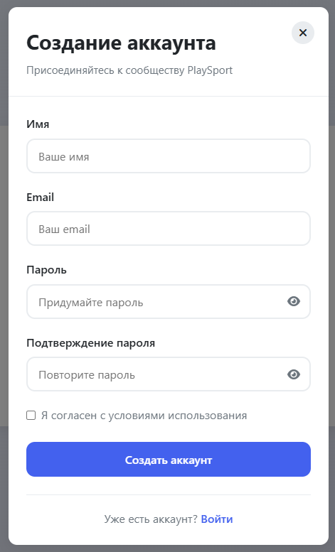
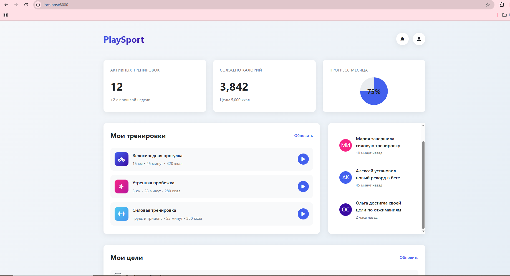
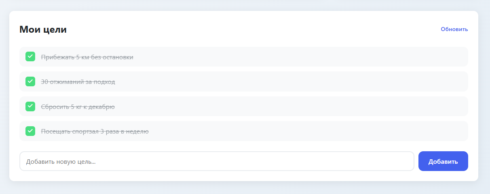

# PlaySport - Система спортивного трекера

## Назначение проекта
Проект PlaySport представляет собой backend-систему для веб-приложения спортивного трекера. Основная цель разработки - создание масштабируемой и поддерживаемой архитектуры с применением современных паттернов проектирования в рамках учебной дисциплины "Технологии и методы программирования" МИИГАиК.

## Визуальное представление приложения

### Главный экран приложения

*Главная страница с приветствием и кнопками для входа/регистрации*

### Авторизация пользователя

*Форма входа с полями для email и пароля*

### Регистрация нового пользователя

*Форма создания нового аккаунта*

### Панель управления (Dashboard)

*Основная панель с статистикой, тренировками и активностью*

### Управление целями

*Раздел для постановки и отслеживания спортивных целей*

## Архитектурные решения

### Архитектура MVC
Система построена на основе паттерна Model-View-Controller с четким разделением ответственности:

**Модели (Model)** - `src/models/`
- Отвечают за бизнес-логику и работу с данными
- Реализуют сущности: User, Workout, Goal
- Инкапсулируют методы CRUD операций

**Контроллеры (Controller)** - `src/controllers/`
- Обрабатывают HTTP-запросы от клиентов
- Координируют взаимодействие моделей и представлений
- Реализуют бизнес-логику приложения

**Представления (View)** - `src/views/`
- Формируют JSON-ответы для API
- Отвечают за сериализацию данных
- Предоставляют единый интерфейс для клиентов

### Примененные паттерны проектирования

1. **Singleton (Одиночка)** - Config
   - Гарантирует единый экземпляр конфигурации
   - Потокобезопасная реализация с double-checked locking

2. **Factory (Фабрика)** - ModelFactory
   - Централизованное создание объектов моделей
   - Сокрытие сложности инстанцирования

3. **Strategy (Стратегия)** - AuthStrategy
   - Возможность выбора алгоритма аутентификации
   - Легкое добавление новых методов авторизации

4. **Adapter (Адаптер)** - DataAdapter
   - Преобразование данных между различными форматами
   - Унификация интерфейсов работы с данными

5. **Observer (Наблюдатель)** - NotificationService
   - Реализация системы оповещений
   - Слабая связь между компонентами

6. **Producer-Consumer (Производитель-Потребитель)** - TaskQueue
   - Эффективная обработка асинхронных задач
   - Балансировка нагрузки между потоками

## Техническая реализация

### Основные компоненты

**HTTP Сервер** - Реализован на базе сокетов с поддержкой:
- Обработки статических файлов из `public/`
- RESTful API endpoints
- Параллельной обработки запросов через пул потоков

**Сервисный слой** - `src/services/`
- AuthService - управление сессиями и токенами
- NotificationService - система событий и уведомлений
- TaskQueue - менеджер фоновых задач

**Стратегии** - `src/strategies/`
- JwtAuthStrategy - аутентификация через JWT токены
- BasicAuthStrategy - базовая HTTP аутентификация

### API Endpoints

Система предоставляет следующие REST API:

- `POST /api/login` - аутентификация пользователя
- `POST /api/register` - регистрация нового пользователя
- `GET /api/users` - получение списка пользователей
- `GET /api/workouts` - получение тренировок пользователя
- `GET /api/goals` - управление спортивными целями
- `GET /api/stats` - статистика и аналитика

## Сильные стороны проекта

1. **Многопоточность** - Асинхронная обработка запросов через пул потоков
2. **Паттерн MVC** - Четкое разделение ответственности компонентов
3. **Конфигурируемость** - Централизованное управление настройками
4. **Расширяемость** - Легкое добавление новых моделей и контроллеров
5. **Безопасность** - Реализация системы токенов и хэширования паролей
6. **Кроссплатформенность** - Поддержка Windows и Unix-систем

## Сборка и запуск

Проект использует CMake для сборки:

```bash
mkdir build
cd build
cmake ..
cmake --build .
./playsport
```

Сервер запускается на порту 8080 и предоставляет:
- Frontend: http://localhost:8080
- API: http://localhost:8080/api/*

## Технологический стек

- Язык: C++17
- Сборка: CMake
- Архитектура: MVC + Микросервисный подход
- Сеть: Беркли-сокеты (кроссплатформенная реализация)
- Форматы данных: JSON
- Параллелизм: Стандартная библиотека C++ (thread, mutex, atomic)

## Учебные цели

Проект демонстрирует практическое применение:
- Архитектурных паттернов (MVC, Микросервисы)
- Паттернов проектирования GoF
- Принципов SOLID и чистого кода
- Многопоточного программирования
- Работы с сетевыми протоколами
- Системного проектирования backend-приложений

Проект разработан в рамках учебного курса МИИГАиК и служит примером применения теоретических знаний о паттернах проектирования на практике.